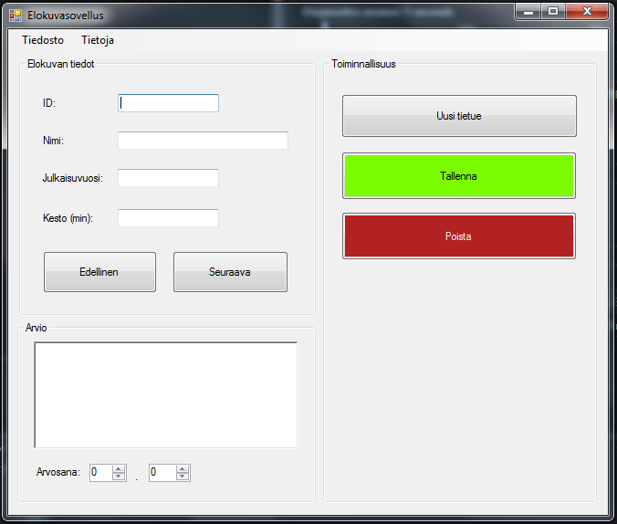

# 01_WindowsFormsPerusteet

Toteuta oheisten kovien mukainen Windws Forms käyttöliittymä (dialogi).
Toiminnallisuutta ei vielä tarvitse toteuttaa. *Huom!* Huomaatko mitään ulkoasuun liittyvä heikkouksia esimerkissä?

https://learn.microsoft.com/en-us/visualstudio/ide/create-csharp-winform-visual-studio?view=vs-2022

Kuva 1. Päänäkymä

Kuva 2. Menubar tiedosto

Kuva 3. Menubar tietoja
