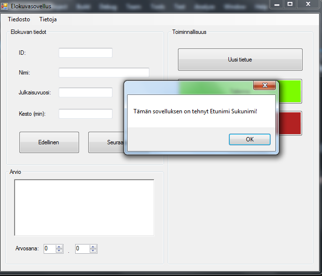
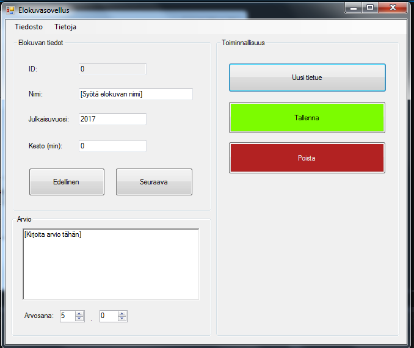

# Toiminnallisuuden lisääminen

Jatka edellistä sovellusta.

1. Lisää toiminnalisuus kun käyttäjä valitsee valikosta kohdan "Tietoja --> Info", esitetään MessageBox, joka kertoo ohjelman tekijän:
  
  
  
  Kuva 1. Etunimi ja sukynimi näytölle
  
  Huom! Painikkeen koodia pääsee muokkaamaan tuplaklikkaamalla painiketta formin muokkauksessa.

2. Lisää toiminnallisuus kun käyttäjä painaa "Uusi tietue"-painiketta, tyhjentyvät syöttökentät ja niihin tulee oletustekstit:
  Elokuva kenttä: "Syötä elokuvan nimi"
  Julkaisuvuosi: tämä (nykyinen vuosi) Huom! Vuoden tulee siis olla oikeasti se vuosi jolloin ohjelmaa ajetaan. Ei kovakoodattu esim. "2021".
  

3. Muuta ID-tekstikentän ReadOnly-property arvoksi: True. Nyt ID-kentän arvoa ei käyttäjä voi muuttaa. Se tulee aina tietokannasta joka tapauksessa.

Kuva 2. Oletusarvojen lisäys

4. Lisää vielä valikkoon toiminto Tiedosto -> Poistu niin, että ohjelma sulkeutuu kun valitset sen valikosta.

5. Lisää nimi, kesto ja arvio kenttiin tapahtuma (event). Joka pyyhkäisee oletustekstin pois, kun kenttä valitaan, niin ettei käyttäjän tarvitse sitä poistaa.

6. Lisää tarkistus, joka lisää oletustekstin kenttään siitä poistuessa, jos se on (edelleen tai taas) tyhjä.

Vinkkejä ja oppimateriaalia:

  Nykyisen vuoden saaminen koodissa:
    https://stackoverflow.com/questions/3890956/how-to-get-current-month-and-year

  Ohjelmasta poistuminen:
    https://msdn.microsoft.com/en-us/library/ms157894(v=vs.110).aspx
