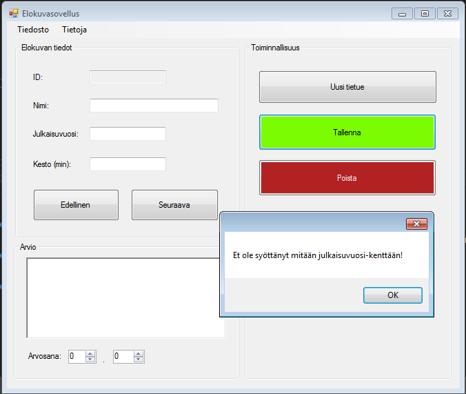
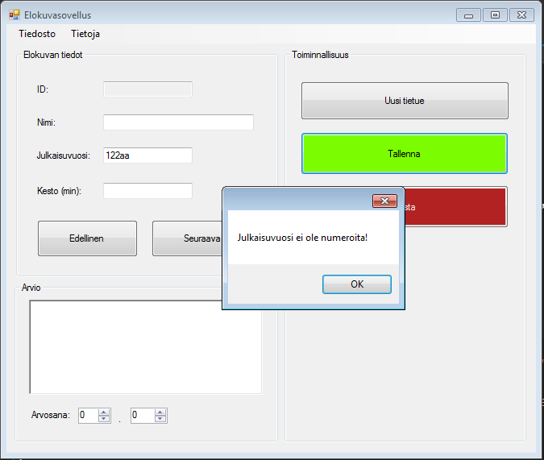
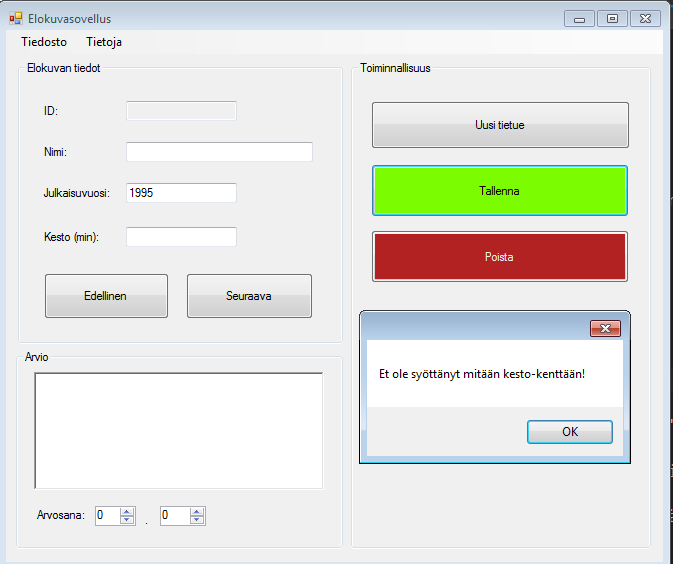
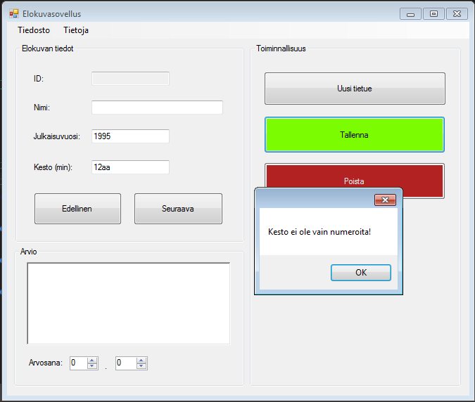
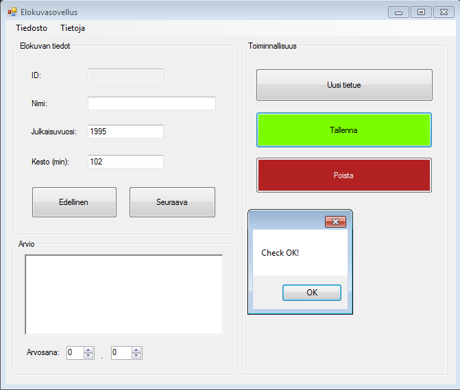

# 03_IfElse rakenne

Tee If – else if rakenteella seuraavat toiminnallisuudet Tallenna-painikkeeseen:

1. Kun painetaan tallenna, tarkistetaan yhdessä samassa if-else rakenteessa: 

2. Onko tekstiä syötetty ollenkaan (eli onko kenttä tyhjä) 

3. Onko tekstin muoto oikea numerokentissä (kesto ja julkaisuvuosi saa sisältää vain numeroita) 

4. Jos tulee virhe, laitetaan MessageBox-ilmoitus ohjelmaan 

Kuva 1. Julkaisuvuosi kenttä on tyhja

Kuva 2. Annettu arvo ei ole numero

Kuva 3. Kesto kenttä on tyhjä

Kuva 4. Kesto kenttä ei ole vain numeroita

Kuva 5. Kaikki ok!

## Vinkkejä ja oppimateriaalia 

 
Jos ei ole ihan varma, miten if elseif else-rakennetta voi tehdä, katso tämä lyhyt video: 

 
C# Beginners Tutorial - 6 - If Statements 

https://youtu.be/QX-x-48xP5U

Miten testata, onko teksti vain numeroita: 

https://stackoverflow.com/questions/894263/how-do-i-identify-if-a-string-is-a-number 

 
Tekstin pituuden testaus: 

https://msdn.microsoft.com/en-us/library/system.string.length(v=vs.110).aspx 
 
