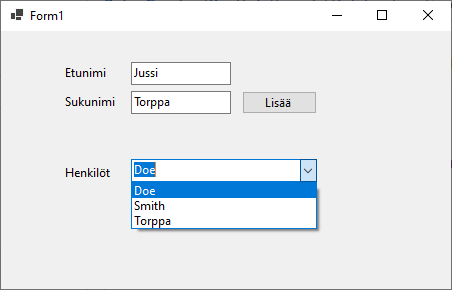

# Task: Data Binding in Windows Forms

## Goal:
Äskeisen tehtävän tavalla jokainen kontrolli joudutaan päivittämään, aina lähde datan muuttuessa. Usein on parempi käyttää Databinding ominaisuutta, jossa näytettävä data sidotaan johonkin lähteeseen BindingList tai BingdinSource(vain winfowms)
Implement data binding in a Windows Forms application to showcase the power and simplicity of connecting UI elements to data sources.

## Steps:


### 2. Design the User Interface:

- Open the Form1.cs file in the designer.
- Add controls to the form that you want to bind to data (e.g., TextBoxes, Labels, DataGridView).

 

### 3. Create a Data Model:

- Define a simple data model class that represents the data you want to bind.
- Example:

  ```csharp
  public class Person
  {
        public string FirstName { get; }
        public string LastName { get; }

        public Person(string fName, string lName)
        {
            FirstName = fName;
            LastName = lName;
        }

### 4. Add a Binding Source:


- Set the `DataSource` property to the `BindingList`.

  ```csharp
  public partial class Form1 : Form
  {
      private BindingList<Person> listOfPersons;
     

      public Form1()
      {
          InitializeComponent();
          
          // Initialize the data source (replace with your data retrieval logic).
          people = GetPeopleData();

       
            // Initialize the data source (replace with your data retrieval logic).
            // Create a BindingList and
            listOfPersons = new BindingList<Person>();
            GetDefaultPeopleData();
      }

      private void Form1_Load(object sender, EventArgs e)
        {
            cbPersons.DataSource = listOfPersons;
            cbPersons.DisplayMember = "LastName";
        }

      private void GetDefaultPeopleData()
        {
            // Replace this method with your data retrieval logic.
            listOfPersons.Add(new Person("John", "Doe"));
            listOfPersons.Add(new Person("Jane", "Smith"));
            // Add more sample data as needed.    
        }
  }
### 5. Add new data to BindingList:
  -Add functionality button where you can add new Person to BindingList.
  -Check that ListBox updates correctly


